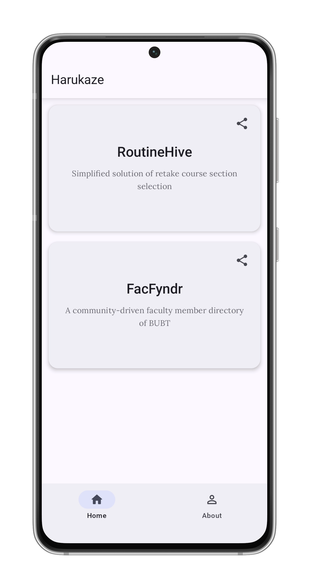
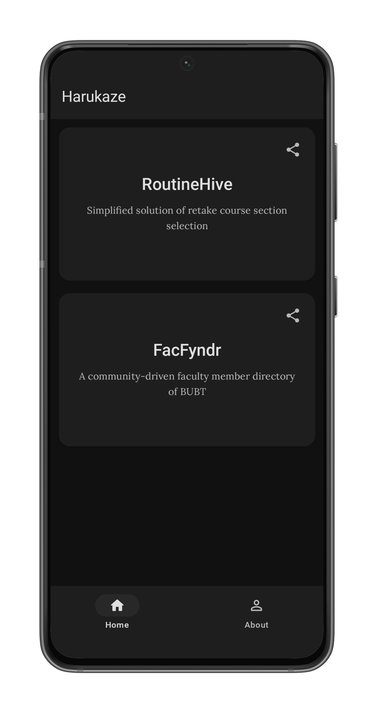
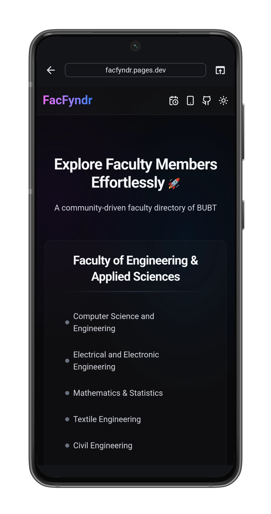
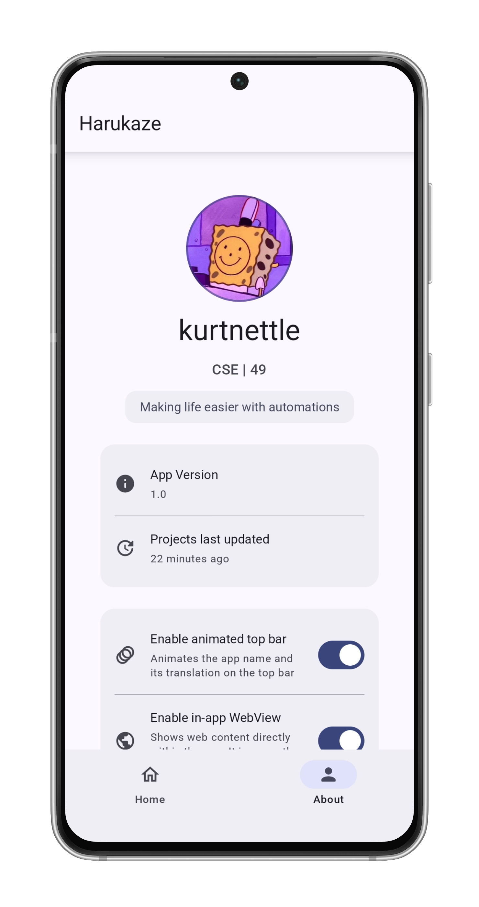
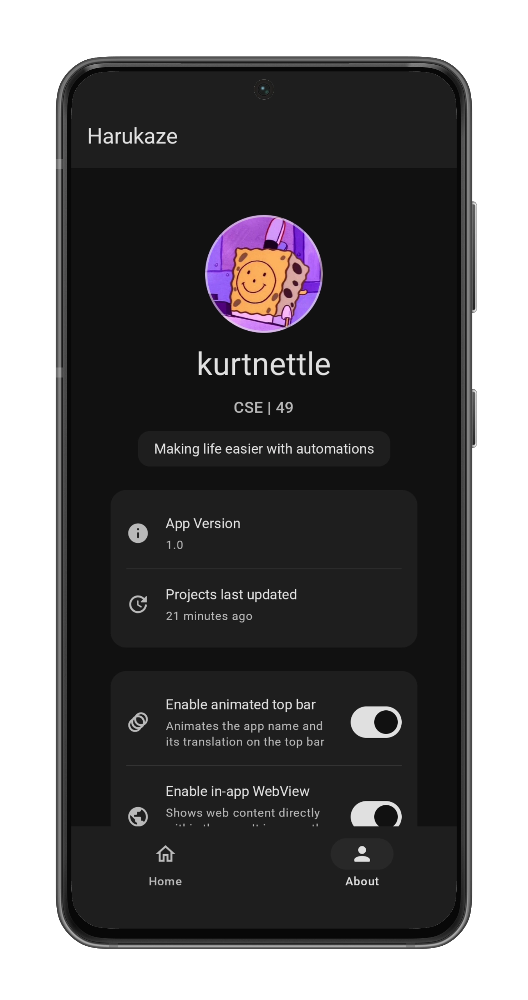

# Harukaze 

**Harukaze** (Japanese _spring breeze_) is an android app developed to provide easy access to
various projects related to [BUBT](https://bubt.edu.bd) developed by me.
Good bye to long unmemorable long URLs

## Table of Contents

- [App Name Story](#app-name-story)
- [Screenshot](#screenshot-📷)
- [Developing](#developing-💻)
- [Contributing](#contributing-🤝)
- [Support](#support-💬)
- [Credits](#credits-🌟)
- [License](#license-📜)

### App Name Story

I struggled to find a name for the app, then I _somehow_ turned to Japanese words and found one that
resonated. It also aligned with the semester name (Spring 2025) I was in, making it feel like the
perfect fit!

## Screenshot 📷

<table cellspacing="0" cellpadding="0">
  <tr style="border:none">
    <td style="border:none">
      
    </td>
    <td style="border:none">
      
    </td>
  </tr>
  <tr>
    <td style="border:none">
      
    </td>
    <td style="border:none">
      
    </td>
  </tr>  
    <tr>
      <td style="border:none">
      
    </td>
    <td style="border:none">
      
    </td>
  </tr>
</table>

## Developing 💻

1. Clone the repository:

   `git clone https://github.com/kurtnettle`

2. Open in Android Studio

3. Change the config url in `utils/Constants.kt` (Refer to `data/models/AppConfig` for JSON schema)

4. Build the project

5. Run on device 🚀

## Contributing 🤝

I welcome contributions from the community! To contribute, please follow these steps:

1. **Fork the Repository:** Create your own copy.

2. **Open an Issue:** Report bugs or suggest features.

3. **Submit a Pull Request:** Ensure your code is well-tested and follows project standards.

## Support 💬

Need help or want to discuss issues? Join our [Telegram group](https://t.me/harukaze_bubt)

## Credits 🌟

### Open-Source Libraries and Tools 🛠️

#### Android & Jetpack

- **AndroidX Core KTX**: Kotlin extensions for core components
- **Jetpack Compose**: Modern declarative UI toolkit
- **Android Lifecycle**: Lifecycle-aware components
- **DataStore**: Data storage solution

#### Third-Party Libraries

- **Koin**: Dependency injection framework
- **Ktor**: Asynchronous HTTP client
- **Timber**: Advanced logging utility

#### UI Components

- **Material 3**: Material Design components
- **Material Icons Extended**: Extended icon pack
- **Lottie Compose**: Animated vector graphics

#### Fonts

- **Google Fonts**: Lora and Roboto

#### Testing

- **JUnit**: Unit testing framework
- **Espresso**: UI automation tests

#### Development Tools

- **Android Studio**: IDE for Android development
- **Gradle**: Build automation tool

### Special thanks 🙌

#### For the tutorials

- [Philipp Lackner](https://github.com/philipplackner)
- [Mohammed Sohail](https://github.com/YoursSohail)

#### For the awesome free mockup generator

- [MockUPhone by Skymakers](https://github.com/oursky/mockuphone.com)

## License 📜

This project is licensed under the **GNU General Public License v3.0 (GPLv3)**. See
the [LICENSE](LICENSE) file for full details.

By contributing, you acknowledge that your submissions will also be licensed under **GPLv3**.
